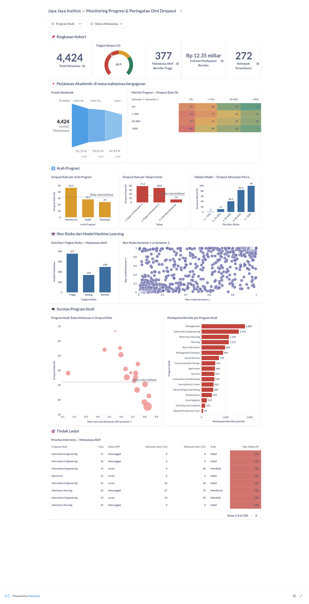

# Proyek Akhir: Menyelesaikan Permasalahan Perusahaan Edutech

**Sistem Peringatan Dini Dua Titik Pantau — Jaya Jaya Institut**

| | |
|---|---|
| **Nama** | Abyan Hisyam |
| **Email** | abyanhisyamm@gmail.com |
| **Id Dicoding** | [ISI ID DICODING ANDA] |

---

## Business Understanding

**Jaya Jaya Institut** adalah perguruan tinggi yang berdiri sejak tahun 2000 dengan reputasi lulusan
yang baik. Namun dari 4.424 mahasiswa dalam catatan historisnya, **1.421 orang (32,1%) berhenti
sebelum menyelesaikan pendidikan**.

Yang membuat masalah ini sulit ditangani bukan hanya besarnya angka, melainkan **waktunya**.
Institusi baru mengetahui seorang mahasiswa berhenti ketika surat pengunduran diri masuk — saat itu
seluruh pilihan intervensi sudah tertutup. Padahal proses menuju *dropout* berlangsung bertahap dan
meninggalkan jejak dalam data akademik jauh sebelum keputusan berhenti diambil.

Dampaknya menyentuh langsung keberlangsungan institusi: hilangnya pendapatan SPP untuk seluruh sisa
masa studi, turunnya rasio kelulusan yang menjadi komponen penilaian akreditasi, serta rusaknya
reputasi di mata calon mahasiswa.

Karena itu proyek ini tidak berhenti pada pertanyaan *"siapa yang berisiko?"*, tetapi menambahkan
pertanyaan yang sama pentingnya: ***"kapan kita paling awal bisa tahu, dan apakah pengetahuan itu
masih cukup akurat untuk ditindaklanjuti?"***

### Permasalahan Bisnis

1. **Deteksi selalu terlambat.** Institusi bersifat reaktif; tidak ada mekanisme yang memberi sinyal
   di tengah masa studi ketika bimbingan masih bisa mengubah hasil.
2. **Tidak diketahui kapan titik pantau paling efektif.** Menunggu data dua semester memberi
   prediksi lebih akurat, tetapi memangkas waktu yang tersisa untuk bertindak. Sebaliknya memantau
   setelah satu semester memberi waktu lebih panjang dengan akurasi lebih rendah. *Trade-off* ini
   belum pernah diukur.
3. **Ambang batas peringatan ditentukan tanpa dasar ekonomi.** Menandai terlalu banyak mahasiswa
   membuang kapasitas tim bimbingan; menandai terlalu sedikit membuat institusi kehilangan
   mahasiswa. Belum ada perhitungan yang menyeimbangkan keduanya.
4. **Kapasitas bimbingan terbatas** sehingga dibutuhkan pemeringkatan prioritas, bukan sekadar
   daftar berisiko.

### Cakupan Proyek

1. **Data Understanding & EDA** — dengan penekanan pada **progresi antar-semester**: bagaimana posisi
   akademik mahasiswa berubah dari semester 1 ke semester 2, dan pola perubahan mana yang berujung
   pada *dropout*.
2. **Feature Engineering** — membentuk fitur turunan yang merepresentasikan *laju* dan *arah*
   performa (rasio kelulusan SKS, selisih antar-semester, indeks tekanan finansial), bukan hanya
   nilai mentahnya.
3. **Data Preparation** — menyusun **dua set fitur terpisah** sesuai titik pantau: satu berisi hanya
   data yang benar-benar sudah tersedia di akhir semester 1, satu lagi lengkap dua semester.
4. **Modeling** — membandingkan tiga algoritma berbasis pohon (*Decision Tree*, *Extra Trees*,
   *HistGradient Boosting*) dan melatih **dua model checkpoint**, masing-masing dituning dengan
   `RandomizedSearchCV`.
5. **Evaluation** — memilih ambang batas melalui **analisis biaya**, bukan berdasarkan tampilan
   grafik, lalu menguji seberapa peka keputusan itu terhadap asumsi biaya yang dipakai.
6. **Business Dashboard** — dashboard Metabase yang menggabungkan data historis **dan skor risiko
   hasil model**, sehingga manajemen melihat kondisi sekaligus prediksi dalam satu tempat.
7. **Deployment** — *prototype* Streamlit dengan pemilih titik pantau, panel asumsi biaya yang bisa
   diubah, dan simulator *what-if*.

**Batasan proyek:** data berasal dari satu institusi dan tidak memuat alasan berhenti, kondisi
psikologis, maupun catatan kehadiran. Model memberi peringkat risiko, bukan vonis, dan tidak boleh
dipakai sebagai dasar sanksi akademik.

---

## Persiapan

**Sumber data:** [Students' Performance Dataset — Dicoding Academy](https://github.com/dicodingacademy/dicoding_dataset/tree/main/students_performance)
(UCI Machine Learning Repository: *Predict students' dropout and academic success*, Realinho dkk.,
2021). Berkas disertakan sebagai `data.csv` — 4.424 baris × 37 kolom, delimiter `;`.

**Setup environment:**

Proyek ini menggunakan **Python 3.10 atau lebih baru**.

```bash
# 1. Clone repositori dan masuk ke direktori proyek
git clone <URL-REPOSITORI-ANDA>
cd <NAMA-FOLDER-PROYEK>

# 2. Membuat dan mengaktifkan virtual environment
python -m venv venv

# Windows (PowerShell)
venv\Scripts\activate
# macOS / Linux
source venv/bin/activate

# 3. Instal dependensi untuk menjalankan prototype
pip install -r requirements.txt

# 4. (Opsional) Dependensi tambahan untuk menjalankan ulang notebook
pip install -r requirements-notebook.txt
```

**Struktur berkas:**

```
.
├── README.md                        # Dokumentasi proyek (berkas ini)
├── notebook.ipynb                   # Seluruh proses data science, terdokumentasi per tahapan
├── app.py                           # Prototype Streamlit (sistem peringatan dini)
├── requirements.txt                 # Dependensi prototype Streamlit
├── requirements-notebook.txt        # Dependensi tambahan untuk notebook
├── data.csv                         # Dataset mentah
├── dataset_README.md                # Kamus data (penjelasan tiap kolom)
├── metabase.db.mv.db                # Ekspor database instance Metabase (dashboard + akun)
├── docker-compose.yml               # Stack dashboard: PostgreSQL + Metabase
├── model/
│   └── model_dropout.joblib         # Dua model checkpoint + ambang batas + metadata
├── metabase-data/
│   └── metabase.db.mv.db            # Salinan kerja yang dipakai docker-compose
└── dashboard/
    ├── mahasiswa_dashboard.csv      # Data siap-dashboard (label + skor risiko dari model)
    ├── schema.sql                   # Definisi tabel PostgreSQL
    ├── init/                        # Skrip seeding otomatis PostgreSQL
    └── abyanhisyam-dashboard.png    # Tangkapan layar dashboard
```

---

## Business Dashboard

Business dashboard dibangun menggunakan **Metabase** yang terhubung ke basis data **PostgreSQL**.
Berbeda dari dashboard pelaporan biasa, dashboard ini memuat **dua lapis informasi sekaligus**: data
historis (apa yang sudah terjadi) dan **skor risiko hasil model machine learning** untuk setiap
mahasiswa (apa yang diperkirakan akan terjadi).

Dashboard terdiri dari **15 kartu visualisasi** dalam lima bagian bernarasi:

**1. Ringkasan Kohort (5 KPI)**
Total Mahasiswa (4.424), **Tingkat Retensi** dalam bentuk *gauge* (60,9% — dihitung hanya dari
mahasiswa berstatus final), Mahasiswa Aktif Berisiko Tinggi (**377** hasil prediksi model),
Estimasi Pendapatan Berisiko (**Rp 12,35 miliar**), dan **Kelompok Tersembunyi** (**272** mahasiswa).

**2. Perjalanan Akademik — di mana mahasiswa berguguran**
- ***Funnel chart***: Terdaftar (4.424) → Lolos Semester 1 (76,8%) → Lolos Semester 1 & 2 (70,6%) →
  Lulus (49,9%). Memperlihatkan bahwa kebocoran terbesar justru terjadi **setelah** dua semester
  akademik terlewati.
- ***Matriks Progresi***: tabel silang performa semester 1 × semester 2 dengan pewarnaan bertingkat,
  berisi tingkat *dropout* tiap kombinasi. Inilah visual inti proyek — baris paling bawah
  memperlihatkan mahasiswa berprestasi yang jatuh di semester 2 mencapai tingkat *dropout* 100%
  bila terjun ke 0%.

**3. Arah Progresi**
- Dropout rate menurut **arah progresi** (Memburuk 46,5% vs Membaik 24,0%).
- Dropout rate per **tahap funnel**.
- ***Validasi Model***: tingkat *dropout* aktual pada tiap pita skor risiko —
  **1% → 11% → 40,5% → 83,6% → 99%**. Kenaikan yang rapi ini membuktikan skor model terkalibrasi
  dengan kenyataan, bukan sekadar angka yang enak dilihat.

**4. Skor Risiko dari Model Machine Learning**
- Distribusi tingkat risiko 794 mahasiswa aktif (Tinggi 377 / Sedang 169 / Rendah 248).
- ***Scatter plot*** skor model semester 1 versus semester 2. Titik yang berada jauh di atas garis
  diagonal adalah mahasiswa yang tampak aman setelah semester 1 namun berisiko setelah semester 2 —
  kelompok yang paling mudah terlewat.

**5. Sorotan Program Studi**
- ***Bubble chart*** rasio kelulusan semester 1 versus dropout rate, ukuran gelembung menurut jumlah
  mahasiswa.
- **Pendapatan berisiko per program studi** dalam rupiah, sebagai dasar alokasi anggaran bimbingan.

**6. Tindak Lanjut**
Tabel **Prioritas Intervensi** berisi mahasiswa aktif berisiko tinggi dengan pewarnaan bertingkat
pada kolom skor, siap dibagikan kepada dosen wali.

Dashboard dilengkapi **dua filter interaktif**: *Program Studi* dan *Status Mahasiswa*.

### Tangkapan Layar



### Cara Menjalankan Dashboard

Seluruh stack sudah dikemas dalam `docker-compose.yml`, sehingga cukup satu perintah:

```bash
docker compose up -d
```

Perintah tersebut menjalankan dua container:
- **`jjinstitut-postgres`** — PostgreSQL yang **otomatis di-seed** dari
  `dashboard/mahasiswa_dashboard.csv` melalui skrip pada `dashboard/init/`.
- **`jjinstitut-metabase`** — Metabase yang memakai `metabase-data/metabase.db.mv.db`, yaitu
  database instance berisi dashboard, seluruh kartu visualisasi, koneksi basis data, dan akun login.

Tunggu 1–2 menit hingga Metabase selesai *booting*, lalu buka:

> **URL:** <http://localhost:3000>
> **Email:** `root@mail.com`
> **Password:** `root123`

Dashboard tersedia langsung di <http://localhost:3000/dashboard/2>, atau melalui menu
**Collections → Our analytics → "Jaya Jaya Institut — Monitoring Progresi & Peringatan Dini Dropout"**.

Menghentikan stack:

```bash
docker compose down
```

**Catatan mengenai `metabase.db.mv.db`:** berkas hasil ekspor sesuai ketentuan berada di **direktori
utama** repositori ini, diekspor dengan perintah berikut setelah container dihentikan agar berkas
H2 dalam keadaan konsisten:

```bash
docker cp jjinstitut-metabase:/metabase.db/metabase.db.mv.db ./
```

Salinan identik juga ditempatkan pada `metabase-data/` agar `docker compose up -d` langsung
memakainya tanpa langkah tambahan.

---

## Menjalankan Sistem Machine Learning

*Prototype* dibangun menggunakan **Streamlit** dan berfungsi sebagai sistem peringatan dini bagi
dosen wali serta bagian akademik.

### Menjalankan secara lokal

```bash
# Pastikan virtual environment sudah aktif dan dependensi terinstal
pip install -r requirements.txt

# Jalankan aplikasi
streamlit run app.py
```

Aplikasi terbuka otomatis di browser pada <http://localhost:8501>.

### Link prototype (Streamlit Community Cloud)

> **Link aplikasi:** `<ISI DENGAN URL STREAMLIT CLOUD ANDA>`

Langkah *deployment*:

1. *Push* seluruh isi folder ini ke sebuah repositori **GitHub publik**.
2. Buka <https://share.streamlit.io>, login dengan akun GitHub.
3. Klik **Create app → Deploy a public app from GitHub**, pilih repositori tersebut.
4. Isi **Main file path** dengan `app.py`, lalu klik **Deploy**.
5. Setelah selesai, buka **Settings → Sharing** dan pastikan visibility diatur ke **public**
   agar aplikasi dapat diakses tanpa login.
6. Salin URL yang diberikan ke baris **Link aplikasi** di atas.

Pada `requirements.txt`, `scikit-learn` dipin persis pada versi saat model dilatih agar berkas
`.joblib` termuat tanpa peringatan kompatibilitas. Sementara `numpy`, `scipy`, dan `pandas` sengaja
hanya diberi **batas minimum** — pin yang terlalu ketat membuat pip gagal menemukan *wheel* untuk
versi Python yang dipakai Streamlit Cloud, lalu mencoba mengompilasi dari *source* sehingga proses
*deployment* menggantung lama di tahap `Preparing metadata (pyproject.toml)`.

### Fitur aplikasi

**Panel samping — pengaturan sistem.**
Pemilih **titik pantau** (Akhir Semester 1 atau Semester 2) yang mengganti model sekaligus
menyesuaikan formulir input, ringkasan metrik model terpilih, serta **tiga asumsi biaya yang dapat
diubah langsung** (kerugian per *dropout*, biaya intervensi, peluang keberhasilan). Ambang batas
peringatan dihitung ulang otomatis dari ketiga angka tersebut.

**Mode 1 — Penilaian Individu.**
Formulir input terkelompok, menampilkan probabilitas risiko, tingkat risiko, saran tindakan,
**ekspektasi kerugian dalam rupiah**, dan penilaian apakah intervensi layak secara ekonomi.
Dilengkapi **simulator *what-if*** yang menghitung ulang risiko untuk tiap perbaikan yang mungkin
(tunggakan dilunasi, beasiswa diberikan, rasio kelulusan naik ke 80%) lalu mengurutkannya
berdasarkan dampak — sehingga dosen wali tahu tindakan mana yang paling berpengaruh. Tersedia pula
pembanding skor antar titik pantau.

**Mode 2 — Pemindaian Angkatan.**
Mengunggah data satu angkatan dalam CSV (pemisah `;` atau `,` terdeteksi otomatis). Menampilkan
jumlah mahasiswa per kategori tindakan, ekspektasi pendapatan berisiko, perkiraan biaya intervensi,
daftar prioritas terurut, dan tombol unduh hasil.

**Mode 3 — Cara Kerja Sistem.**
Perbandingan kedua model, penjelasan asal-usul rumus ambang batas, ringkasan algoritma dan data,
daftar fitur paling berpengaruh, serta batasan penggunaan.

---

## Conclusion

### Menjawab permasalahan bisnis

**1. Deteksi selalu terlambat — kini bisa dilakukan sejak akhir tahun pertama.**
Model titik pantau semester 1 menangkap **92,6% mahasiswa yang akan *dropout*** hanya dengan data
yang sudah tersedia beberapa bulan setelah mereka masuk.

**2. Kapan titik pantau paling efektif — kini terjawab dengan angka.**
Menambah data satu semester hanya menaikkan ROC-AUC dari **0,940 ke 0,956**, dan kemampuan
mendeteksi praktis tidak berubah (recall 92,6% vs 92,2%). Yang benar-benar meningkat adalah
**precision: 68,3% menjadi 80,4%**. Kesimpulannya bukan memilih salah satu, melainkan memakai
keduanya dengan peran berbeda:

| Titik pantau | Kekuatan | Peran operasional |
|---|---|---|
| **Akhir Semester 1** | Recall 92,6%, waktu bertindak masih panjang | **Penyaringan luas** — kontak ringan, undangan tutoring, pengecekan kondisi finansial |
| **Akhir Semester 2** | Precision 80,4%, daftar jauh lebih bersih | **Penanganan intensif** — konseling wajib, restrukturisasi SPP, kontrak akademik |

**3. Ambang batas kini punya dasar ekonomi.**
Melalui minimisasi ekspektasi biaya diperoleh ambang **0,10** (semester 1) dan **0,15** (semester 2),
konsisten dengan nilai teoretis 0,125. Uji sensitivitas menunjukkan ambang **semester 2 kokoh**
(bertahan pada 0,15–0,375 di seluruh skenario asumsi), sementara ambang **semester 1 jauh lebih
peka** (0,075–0,550). Dibanding kondisi tanpa model, ekspektasi kerugian institusi turun sekitar
**30%**.

**4. Prioritas kini terukur.** Dari 794 mahasiswa aktif, model menandai **377 orang berisiko
tinggi** — merepresentasikan sekitar **Rp 11,3 miliar** pendapatan yang dipertaruhkan.

### Temuan analitis yang paling menentukan

**Ada kelompok berisiko yang tidak terlihat bila hanya memantau semester 1.**
Sebanyak **272 mahasiswa (8,0% dari yang lolos semester 1)** melewati semester pertama dengan baik
lalu anjlok di semester 2 — dan **68,8% di antaranya *dropout***, hampir lima kali lipat dibanding
**14,0%** pada mereka yang bertahan kuat. Kelompok inilah alasan utama mengapa pemantauan tidak boleh
berhenti setelah satu semester.

**Pemulihan itu nyata, sehingga intervensi layak dibiayai.**
Dari mahasiswa yang lemah di semester 1, sebagian berhasil bangkit di semester 2 dan tingkat
*dropout* mereka turun dari **81,3% menjadi 34,9%** — kurang dari separuhnya. Ini bukti empiris bahwa
hasil akhir masih bisa diubah.

**Prestasi akademik tidak melindungi dari masalah keuangan.**
Mahasiswa dengan rasio kelulusan di atas 80% memiliki tingkat *dropout* **8,6%** bila SPP lunas,
tetapi **54,8%** bila menunggak — enam kali lipat, dan lebih tinggi daripada mahasiswa berperforma
sedang yang keuangannya lancar (30,3%). Jalur risiko akademik dan finansial berjalan terpisah.

**Seluruh data yang dibutuhkan sudah dimiliki institusi.** Model hanya memakai kolom yang sudah ada
di sistem akademik dan keuangan. Tidak diperlukan survei atau pengumpulan data baru.

### Rekomendasi Action Items

1. **Mulai dari titik pantau semester 2, lalu tambahkan semester 1 setelah asumsi biaya terverifikasi.**
   Ambang semester 2 (0,15) kokoh di seluruh skenario, sedangkan ambang semester 1 bergerak lebar
   (0,075–0,550). Jalankan lebih dulu siklus semester 2 dengan **penanganan intensif** bagi mahasiswa
   di atas ambang 0,15. Setelah biaya intervensi dan peluang keberhasilan yang sebenarnya diketahui
   (lihat butir 5), aktifkan siklus semester 1 dengan **kontak ringan** pada minggu ke-2 setelah nilai
   keluar. Membedakan bobot tindak lanjut inilah yang membuat *precision* 68% di semester 1 tetap
   dapat diterima secara operasional.

2. **Jadikan penurunan rasio kelulusan sebagai pemicu otomatis, terlepas dari nilai absolutnya.**
   Kelompok "kuat lalu jatuh" memiliki tingkat *dropout* 68,8% dan tidak akan tertangkap oleh aturan
   berbasis ambang nilai. Kolom `arah_progresi` pada dashboard sudah menyediakan sinyal ini — setiap
   mahasiswa berstatus **"Memburuk"** wajib dihubungi dosen wali meskipun nilainya masih di atas batas
   kelulusan.

3. **Pisahkan program intervensi finansial dari intervensi akademik.**
   Karena mahasiswa berprestasi pun rentan ketika menunggak, jalankan **skema cicilan otomatis tanpa
   denda** yang dipicu sejak keterlambatan pembayaran pertama — tanpa mensyaratkan nilai akademik
   tertentu, dan tanpa memblokir akses akademik yang justru mempercepat *dropout*.

4. **Ganti asumsi biaya dengan angka riil institusi, lalu jalankan ulang analisis ambang batas.**
   Nilai kerugian per *dropout*, biaya intervensi, dan peluang keberhasilan yang dipakai bersifat
   ilustratif. Bagian *Uji sensitivitas* pada notebook dapat langsung dijalankan ulang dengan angka
   keuangan sebenarnya, dan panel samping aplikasi Streamlit sudah menyediakan ketiganya sebagai
   input yang bisa diubah.

5. **Ukur peluang keberhasilan intervensi melalui pencatatan yang disiplin.**
   Parameter ini paling menentukan ambang batas namun paling tidak diketahui. Catat setiap intervensi
   beserta hasilnya selama satu tahun ajaran, lalu hitung nilai sebenarnya. Institusi akan memperoleh
   sistem yang mengkalibrasi dirinya sendiri.

6. **Prioritaskan program studi berdasarkan rasio kelulusan semester 1, bukan menunggu angka dropout.**
   Hubungan keduanya kuat (r = −0,87 setelah pencilan dikeluarkan), sementara rasio kelulusan sudah
   diketahui beberapa bulan setelah mahasiswa masuk — sedangkan angka *dropout* baru muncul
   bertahun-tahun kemudian. Kartu **Pendapatan Berisiko per Program Studi** pada dashboard dapat
   dipakai langsung sebagai dasar alokasi anggaran bimbingan.

7. **Latih ulang kedua model setiap tahun ajaran** dengan data angkatan terbaru, dan pantau apakah
   *recall* masih bertahan di kisaran 90%. Penurunan yang konsisten menandakan profil mahasiswa telah
   berubah dan model perlu ditinjau.
